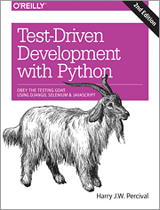

# This project is a simple study demonstrating building test structure options. 
(https://github.com/bobhilt/studies/python/TestingDemo)
## It's simple.  I don't really need tests. ("Without")


## To add tests inline ("Within"):

At the bottom of your code: 

```python
import unittest
class PowerDigitSum(unittest.TestCase):

    def test_15(self):
        self.assertEqual(power_digit_sum(15),26)
    
    ...

if __name__ == '__main__':
    unittest.main()
```

## For extracting tests ("Extracted"):
* no need for adding test-run code to main file(s), e.g,
```python
 if __name__ == '__main__':

    unittest.main()
```

* create ./tests folder
* create ./tests/__init__.py to hook up the path
* create test_*.py files
```python
import unittest
import power_digit_sum2 as pds

class PowerDigitSum(unittest.TestCase):

    def test_digits_of_2_to_15th_is_26(self):
        self.assertEqual(pds.power_digit_sum(15),26)
    ...
```
* command palette: configure tests
** in this case: unittest; tests folder; test files named test_*.py
* command palette: show test output
* discover tests


### Obey the Testing Goat!

Test-Driven Development with Python - Harry Percival
Obey the Testing Goat!

 

More info: <https://www.obeythetestinggoat.com/pages/book.html>
